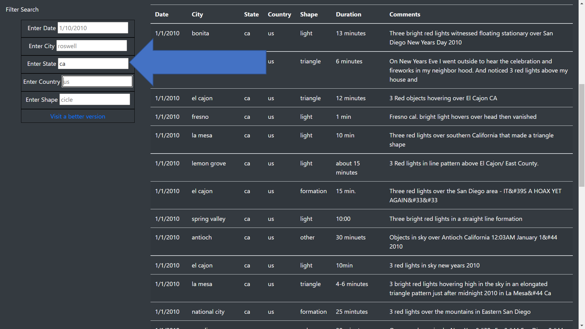

# UFOs
###### Module 11. Bootcamp Javascrip
__________________________________

# Overview
Dana wants to make more dynamic her webpage. She’d like to provide a more in-depth analysis of UFO sightings by allowing users to filter for multiple criteria at the same time.

We add the filters criteria:

- City
- State 
- Country
- Shape

We took out the search button, and add the search automatically when the criteria are entered.

# Results

The UFO sightings web page :

### Desktop view

For example, perform a search of all the sights in the state of California and for shape light.
Javascript will catch the changes on the inputs fields, and show the data that matches with the criteria.

### Example for filters criteria
To perform a search:

- Go to the search form.

- Enter "ca" in the State field.

- Enter "light" in the Shape field.

- Enter "el cajon" in the City field.

The web page filters the information based on the filter criteria, and shows them in real time. 

# Summary

Although the UFO sighting website has new filters, these filters are open, the user can put anything to search and the criteria may not match anything in the data, given zero results and a feeling that maybe the site does not work. Also to perform other searches, the user has to refresh the whole page, and the user does not know how many UFO sightings are based on the filter criteria.

Recommendations for updating the page are:

- Instead of the "open entry" fields, put drop-down menus.
- The options in these drop-down menus have to be the unique data for each criterion.
- Put a clean form button.
- Put a text with the information about how many UFO sightings were based on the filter criteria.

Feel free to explore what the web page will look like with these recommendations. Click on the "Visit a better version" link.

### Desktop view

### Drop-down menus view

For example, for performing a search of all the UFO sightings in the state of California and for shape triangle. You just need, select the value "ca" in the drop-down menu of State, and the value "Triangle" on the Shape drop-down menu. 
Javascript will catch the changes on the inputs fields, and show the data that matches with the criteria, and make the calculus of how many UFO sightings are.

You can perform another search without refresh the whole page, just click on the button "Clean filters"

### Example for filters criteria

